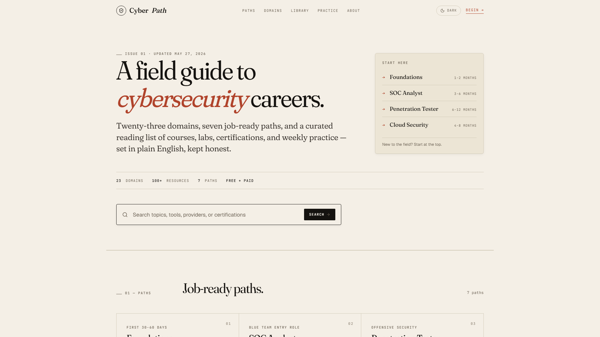

Cybersecurity Analyst & Penetration Tester — offensive security,
threat intelligence, and custom security tooling. CEH | Security+ | eJPT.

 

&nbsp;&nbsp;
&nbsp;&nbsp;

 

### Featured Projects

<table>
<tr>
<td width="50%" valign="top">

 

**[mistan.dev](https://mistan.dev)**

Terminal-themed cyberfolio — Astro, GSAP & Lenis with live GitHub integration

</td>
<td width="50%" valign="top">

 

**[cyberpath.mistan.dev](https://cyberpath.mistan.dev)**

Cybersecurity learning directory — Vite/React with roadmaps, domain paths, and curated resources

</td>
</tr>
</table>

 

### Certifications

&nbsp;
&nbsp;
&nbsp;
&nbsp;
&nbsp;

 

### Tech Stack

&nbsp;
&nbsp;
&nbsp;
&nbsp;
&nbsp;
&nbsp;
&nbsp;
&nbsp;

 

### GitHub Stats

  

 

  

