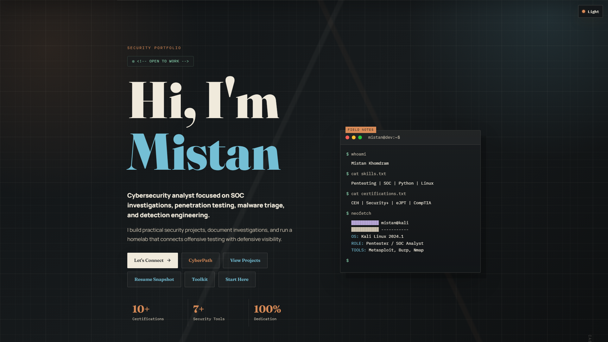
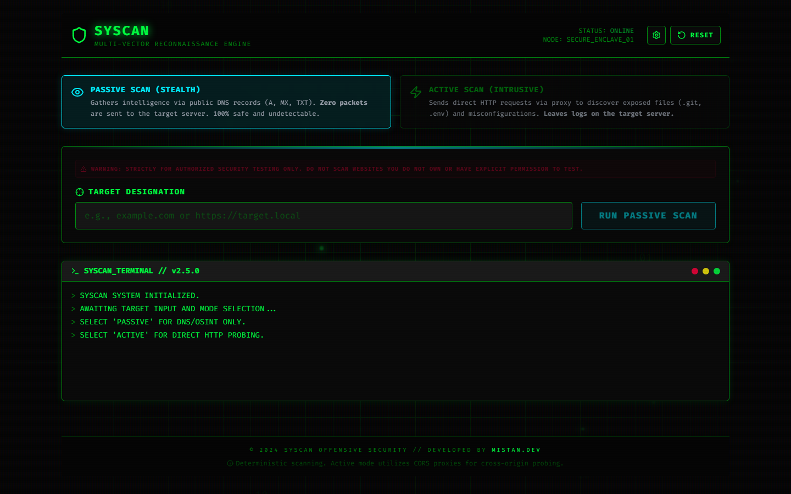

Cybersecurity Analyst & Ethical Hacker — bridging offensive penetration testing and
defensive threat intelligence with custom tooling and live SOC environments.

 

&nbsp;&nbsp;

 

### Featured Projects

| | |
|---|---|
| **[mistan.dev](https://mistan.dev)** | Interactive cyberfolio with cinematic boot sequence, 3D parallax & terminal UI |
| **[SYSCAN](https://syscan.mistan.dev)** | Zero-backend OSINT & vulnerability scanner with BGP fingerprinting, Shodan BYOK & XSS probing |

 

### Tech Stack

&nbsp;
&nbsp;
&nbsp;
&nbsp;
&nbsp;
&nbsp;
&nbsp;

 

### GitHub Stats

  
  &nbsp;&nbsp;
  

 

  

 

  

